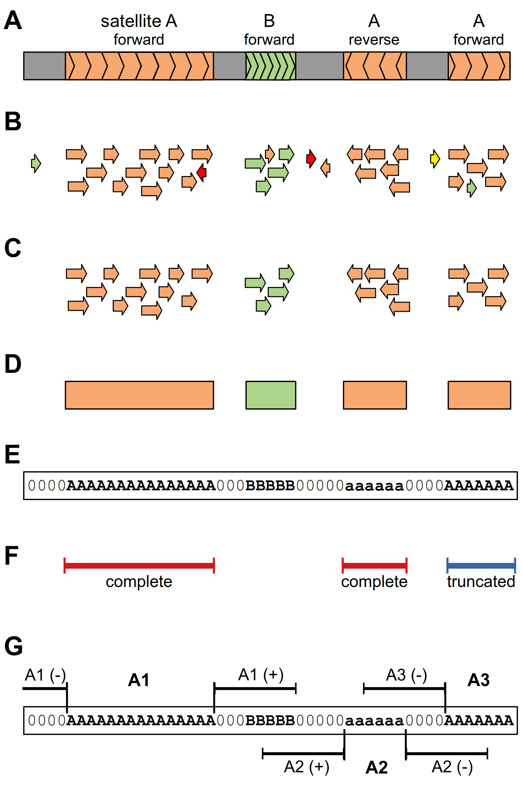

# Annotation of repeats in Oxford Nanopore reads

**Paper:Genome-wide characterization of satellite DNA arrays in a complex plant
genome using nanopore reads (*In preparation*)**

Authors(paper): Tihana Vondrak, Laura Ávila Robledillo, Petr Novák, Andrea
Koblížková, Pavel Neumann and Jiří Macas

The text includes scripts and instruction how to annotated Oxford Nanopore reads
based on the reference libraries of repetitive sequences and how to calculated
neighborhood density profiles.
<hr>
<figure>

<figcaption>
Schematic representation of the analysis strategy. (A) Nanopore read (gray bar) containing
arrays of satellites A (orange) and B (green). The orientations of the arrays with respect to sequences in the
reference database are indicated. (B) LASTZ search against the reference database results in similarity hits
(displayed as arrows showing their orientation, with colors distinguishing satellite sequences) that are
quality-filtered to remove non-specific hits (C). The filtered hits are used to identify the satellite arrays as
regions of specified minimal length that are covered by overlapping hits to the same repeat (D). The
positions of these regions are recorded in the form of coded reads where the sequences are replaced by
satellite codes and array orientations are distinguished using uppercase and lowercase characters (E). The
coded reads are then used for various downstream analyses. (F) Array lengths are extracted and analyzed
regardless of orientation of the arrays but while distinguishing the complete and truncated arrays (here it is
shown for satellite A). (G) Analysis of the sequences adjacent to the satellite arrays includes 10 kb regions
upstream (-) and downstream (+) of the array. This analysis is performed with respect to the array
orientation (compare the positions of upstream and downstream regions for arrays in forward (A1, A3)
versus reverse orientation (A2)).
</figcaption>
</figure>
<hr>

## Annotation of satellite repeats
The goal of this pipeline is to provide annotation of satellite repeats in
Oxford Nanopore reads using similarity search against library of reference
satellite sequences. Information about position, orientation and type of
the satellite repeat in individual Nanopore reads is stored as sequence of
characters in *coded reads*.

The pipeline consists of three main steps: 
 - Similarity search against reference library of satellite repeats using LASTZ
 program
 - Parsing similarity hits to coded reads
 - Analysis of satellite arrays characteristics.

### Running the LASTZ similarity search
The first step to running the pipline is to run the LASTZ alignment program.
For that a fasta file with Nanopore reads and a file with reference sequences is needed.

The sample Nanopore reads:

`/testing_data/sample_nanopore_reads`

The reference sequences:

`/testing_data/reference_database_satellite_and_retrotransposons`

The LASTZ tabular output is first filtered of comment lines which begin with a '#' and sorted based on Nanopore read name.
Promptly the filtered output is passed to a python script which will filter the output based on a minimum bitscore value and maximum length of hit.

The LASTZ command and filtering:
```sh
lastz testing_data/sample_nanopore_reads[multiple,unmask] testing_data/reference_database_satellite_and_retrotransposons \
      --format=general:name1,size1,start1,length1,strand1,name2,size2,start2,length2,strand2,identity,score \
      --ambiguous=iupac --xdrop=10 --hspthresh=1000 | grep -v "#" | sort -k1 | python_scripts/filtering_bit_score_and_percentage.py \
      -b 7000 -x 1.23 > lastz_out
```

> - -b   minimum bit score value used for filtering (in this case the
>   optimised value is 7000)
> - -x   maximum length of hit comparing to the length of the
>   reference (in this case the optimised value of the length is no longer than
>   23% longer than the reference)


### Parsing similarity search to coded reads

The LASTZ output is then parsed to create coded reads.

The coding table is used to assign codes to individual similarity hits based on
the type of the repeat, orientation, minimum length and priority. 

Example of coding table format:


| repeat name      | orientation | code       | minimum length | priority |
|------------------|-------------|------------|----------------|----------|
| LasTR3           | F           | O          |            300 |        3 |
| LasTR3           | R           | o          |            300 |        3 |
| LasTR4           | F           | P          |            300 |        3 |
| LasTR4           | R           | p          |            300 |        3 |
| LTR_Copia_other  | F           | W          |            300 |        2 |
| LTR_Copia_other  | R           | W          |            300 |        2 |
| LTR_gypsy_Athila | F           | Q          |            300 |        2 |
| LTR_gypsy_Athila | R           | Q          |            300 |        2 |


The *repeat name* in the coding table must correspond to the ID used in reference
sequence library followed by double underscore. For example fasta sequence name
`>LasTR3__11_9_sc_0.503375_l_49`  correspond to repeat name `LasTR3` 

For satellite sequences, forward and reverse orientation of the repeat is
distinguished using upper and lower case codes. In case of retrotransposons
repeats, orientation is not recorded and thus codes are only uppercase. The
arrays of similarity hits which were shorter than the *minimum length* are
filtered out. When similarity hits to different type of repeats are detected on
the same region of the read, the code with the higher *priority* (i.e. lower
numerical value ) is recorded. On the other hand, if overlapping similarity hits
to different repeat has the same priority, such regions are assigned a
conflict code **X**.

The LASTZ output is parsed with the command:

```sh
cat  lastz_out | /python_scripts/pseudocoded_reads_priorities.py -c /testing_data/reference_database_satellite_and_retrotransposons.coding_table > coded_out
```

### Analysis of repeat characteristics

In this steps, coded reads are analyzed to quantify occurence of arrays of repeats
in the reads, arrays length distribution and association (co-occurence) of individual repeat types. 

#### Array lengths summary

The length of array of repeats is calculated from coded reads using command:
```sh
python_scripts/satellite_size_distribution.py -i coded_out -s 100 -c /testing_data/reference_database_satellite_and_retrotransposons.coding_table -o coded_length_table
```

> - Option -i takes the pseudocoded multifasta file produced by the previous step
> - Option -s takes the first n number of bases which will create a boundary for classifying arrays as either intact or truncated
> - Option -c takes the coding table used for pseudocoding
> - Option -o takes the output name

Output `coded_length_table` summarized all individual arrays from different
groups as well as their characteristics, extracted from the coded reads. It
contains five columns: the array name, the array length, the pseudocode, read
length and a column which indicates whether the array is intact or truncated.

Example of length table:

| array name     | the array length | the pseudocode | read length | intact/truncated |
|----------------|------------------|----------------|-------------|------------------|
| LTR_gypsy_Ogre |             6172 | Y              |       40976 | T                |
| LasTR5         |              299 | R              |       42386 | I                |


#### Array length distribution

In order to characterize the length distributions of arrays of satellite groups
throughout the genome, the lengths of arrays were binned and summed using
command:
```sh
/python_scripts/plotting_cumulative_lengths_and_frequency_of_occurences.py -i coded_length_table -n 24 -s 5000 -o cumulative_binning_table
```
> - -i length table created in the previous step 
> - -n number of bins
> - -s bin size
> - -o output file name of the binning data

Output `cummulative_bining_table` contains four columns: summed lengths for
intact arrays, summed length for truncated arrays and two more columns for the
frequncy of occurence for intact and truncated arrays within each bin. Each row
represents one bin. Each group has it's own cumulative length table.

Example of binned table:


| Sum_of_length (Intact) | Sum_of_length (Truncated)  | Frequency_intact | Frequency_truncated |
|------------------------|----------------------------|------------------|---------------------|
|                      0 |                          0 |                0 |                   0 |
|                      0 |                          0 |                0 |                   0 |
|                  13478 |                      13085 |                1 |                   1 |


#### Neighborhood density profiles

To quantify and visualize the association of different groups of satellites and
mobile elements, surrounding of each satellite types is analyzed:
```sh
/python_scripts/profile_of_neighborhood.py -r coded_out -w 10000 -s 100 -c /testing_data/reference_database_satellite_and_retrotransposons.coding_table -o coded_neighborhood_profile
```
> - -r input file with coded reads
> - -w window size
> - -s the first n number of bases from which the incrementation will start 
> - -c coding table file
> - -o output file name (pdf format)

The output `coded_neighborhood_profile` table provides a density profile left
and right of each array of a satellite group. The window size of the profile can
be changed but in this case the window size is 10 kb. Each group has it's own
output. The columns in the table match the positions within the windows left and
right, while the rows correspond to different groups. Furthermore a base count
table for each group is made. It is a profile of all the bases counted in the
left and right windows.


## Alternative annotation of repeats using protein domains

Alternative annotation of repeats uses reference DNA sequences for annotation of
satellites only while mobile elements are annotated based on the similarity to
conserved protein domains using DANTE tool. Both
annotation are then combined together.

### Annotation of satellites using LASTZ similarity search
Search is performed against library reference satellited sequences:

The sample Nanopore reads:

`testing_data_protein_domains/sample_nanopore_reads`

The reference sequences:

`testing_data_protein_domains/reference_database_satellites`

The LASTZ output will be filtered in the same way as previously described.


```sh
lastz testing_data_protein_domains/sample_nanopore_reads[multiple,unmask] \
      testing_data_protein_domains/reference_database_satellites \
      --format=general:name1,size1,start1,length1,strand1,name2,size2,start2,length2,strand2,identity,score \
      --ambiguous=iupac --xdrop=10 --hspthresh=1000 | grep -v "#" | sort -k1 | \
    /python_scripts/filtering_bit_score_and_percentage_02.py -b 7000 -x 1.23 > lastz_out
```

### Annotation of mobile element using DANTE
Detection of the retrotransposon protein coding domains in the read sequences
was performed using DANTE, which is a bioinformatics tool available on the
RepeatExplorer server (https://repeatexplorer-elixir.cerit-sc.cz). DANTE perform
repeat annotation based on the similarity searches against the REXdb
protein database (http://www.repeatexplorer.org)⁠. The hits were filtered to pass the
following cutoff parameters: minimum identity = 0.3, min. similarity = 0.4, min.
alignment length = 0.7, max. interruptions (frameshifts or stop codons) = 10,
max. length proportion = 1.2, and protein domain type = ALL. Annotation obtain from DANTE
program in gff3 format were then used for further processing.Example of DANTE
output is in file `testing_data_protein_domains/gff_sample` 


### Parsing annotations to coded reads

Annotation of satellites and mobile element protein domains are combined in two
step. First step creates coded reads based on the satellite annotation only:

```sh
cat  lastz_out | python_scripts/pseudocoded_reads_priorities.py -c testing_data_protein_domains/reference_database_satellites.coding_table > coded_out
```

The second step add annotation of protein domains to previously satellite coded reads:

```sh
/python_scripts/creating_pseudocoded_reads_protein_domains.py -i coded_out -c /testing_data_protein_domains/reference_database_Ogre_domains.coding_table -g  > coded_ogre_domains
```
> - -i input file with previousle coded reads
> - -c coding table specific for protein domain
> - -g gff file with protein domains annotation 

The coding table specific for protein domains contain information about domain
classification and type(according REXdb classification). The example of coding
table for protein domain can be found in file
[reference_database_satellites_and_Ogre_domains.coding_table](./testing_data_protein_domains/reference_database_Ogre_domains.coding_table)

###  Neighborhood density profiles
The neighborhood profiles of the satellites are evaluated as describe above with
some modification - the coding table used for the analysis is file concatatened
from satellite coding table and domains coding table.

```sh
/python_scripts/profiles_of_neighborhood_protein_domains.py -r coded_ogre_domains -w 10000 \
   -c /testing_data_protein_domains/reference_database_satellites_and_Ogre_domains.coding_table \
   -s 100 -o coded_neighborhood_profiles
```

* -r file with coded reads
* -w the size of the window
* -s the first n number of bases from which the incrementation will start 
* -c coding table
* -o name of the pdf output file


## Periodicity analysis
**TODO**

## Examples of data visualisation

Even though the tabular outputs can be visualised in different ways, here three plots will be used to visualise the data created by previously described steps.

> Scatterplot for frequency of array occurence

This scatterplot is created with an R script. It shows the frequency of occurence of arrays with binned lengths. Each satellite and tranposable element group will have it's own plot separate from the rest.
The length table from python script satellite_size_distribution_07.py is used as plotting data.

R command:
```sh
/R_scripts/visualisation_of_size_distribution_log.R coded_length_table /testing_data/reference_database_satellite_and_retrotransposons.coding_table 120000 24 coded_frequency_of_occurence.pdf
```

* Firstly the length table from the previous python script is provided, the coding table, the limiting bin, the number of bins and the pdf name. The limiting bin serves as an upper boundary. If there are arrays longer than the limiting bin, they will be pooled together in the last bin.

> Cumulative length histogram

The cumulative length histogram includes binning array lengths and summing the values within the bins. 
Firstly a python script prepares the length table from python script satellite_size_distribution_07.py with binning the data. 

The python command:
```sh
/python_scripts/plotting_cumulative_lengths_and_frequency_of_occurences.py -i coded_length_table -n 24 -s 5000 -o cumulative_binning_table
```

* Option -i takes the length table created in the previous step 
* Option -n takes the number of bins
* Option -s takes the bin size
* Option -o takes the output name of the binning data

The plotting is then performed by an R script.  Each satellite and tranposable element group will have it's own plot separate from the rest.

The R command:
```sh
/R_scripts/plotting_cumulative_lengths_and_frequency_of_occurence.R . cumulative_binning_table 5000 24 coded_cumulative_lengths.pdf
```

* The first argument takes the path to the binning data in case where it is not in the working directory, while the second argument takes the pattern which is to be searched in the path since each group of elements has it's own binning output, after this the bin size and number is provided and at the end the name of the pdf file to which to write the data

> Neighborhood profiles of satellites and retrotransposons

This plot shows the association or lack thereof between different groups of satellites and mobile elements within a n kb window (in our case it is 10 kb). In this example the density profiles of satellites and retrotransposons were plotted, if however the profiles of satellites and domains are needed,
the two coding domains used for pseudocoding (satellite and coding table) must be concatenated and provided to the R script.

The R command:
```sh
/R_scripts/plotting_profiles_of_satellite_neighborhood.R . coded_neighborhood_profile base_count coded_neighborhood_profile.pdf 10000
```

* The first argument takes the path to the tabular output of the python script in case where it is not in the working directory, the second argument defines the two patterns to be searched in the path since each group has it's own tabular output, then there is the final pdf name and the window size

